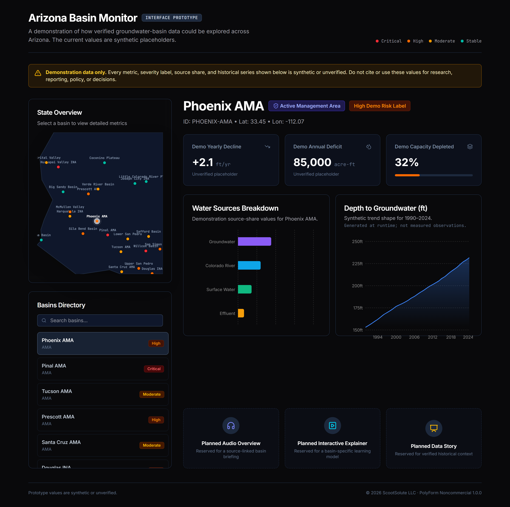
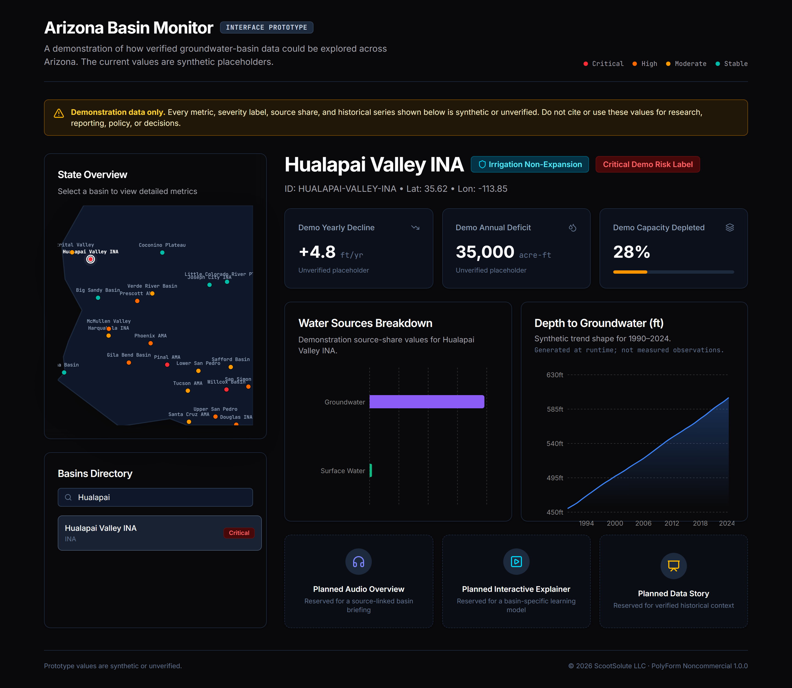

# Arizona Basin Monitor

> An interactive prototype for exploring how verified groundwater-basin data could be compared across Arizona.

Arizona Basin Monitor is a React dashboard concept covering 23 Arizona groundwater basins. It pairs a selectable state map and searchable basin directory with compact views for management status, water sources, depletion indicators, and historical trends.

**Every quantitative value in this release is synthetic or unverified demonstration data.** The interface is public so people can inspect the design and code—not so the displayed numbers can be cited, repeated, or used for policy, research, reporting, or personal decisions.



*The statewide interface with its permanent demonstration-data warning.*



*A selected-basin view. The displayed metrics and chart are placeholders, not measured conditions.*

## What the prototype demonstrates

- A single place to scan and select 23 Arizona basin entries.
- A visual distinction between Active Management Areas, Irrigation Non-Expansion Areas, and other basin groupings.
- A compact comparison pattern for annual deficit, depth change, estimated depletion, and source mix.
- Searchable navigation that works alongside the map rather than depending on map familiarity.
- Reserved spaces for future audio, interactive explanations, and data stories once verified material exists.

## What it does not provide

- Real-time monitoring or telemetry.
- Verified deficit, decline, capacity, depletion, or source-share figures.
- A complete or authoritative classification of every Arizona groundwater basin.
- Legal, scientific, regulatory, or policy guidance.
- Working Gemini, NotebookLM, audio, simulation, or slideshow features.

The historical series is generated at runtime with `Math.sin()` and `Math.random()`. The scalar metrics and water-source percentages are hand-entered placeholders. See [Data status and replacement plan](docs/DATA_STATUS.md) for the exact boundary.

## Why this is separate from Project Save Arizona

This repository is the standalone statewide dashboard prototype. The earlier `Project-Save-Arizona` repository is a separate static resource-center archive with county pages and a national resource-map experiment. The newer `save-mohave-water` workspace embeds this same dashboard code under `dashboard/` and pairs it with a focused Mohave County advocacy site.

In that lineage:

```text
Project Save Arizona archive
    └── broad static resource-center experiment

Arizona Basin Monitor (this repository)
    └── statewide dashboard prototype / future hub

Save Mohave Water workspace
    ├── focused Mohave County advocacy site / spoke
    └── embedded copy of Arizona Basin Monitor / hub prototype
```

The dashboard is published separately because it is a coherent portfolio artifact on its own. The broader archives remain separate context, not duplicate releases.

## Run locally

Requirements: Node.js 18 or newer and npm.

```bash
git clone https://github.com/anitacigawet/Water_Dashboard.git
cd Water_Dashboard
npm install
npm run dev
```

Open `http://127.0.0.1:3000`.

## Development checks

```bash
npm run lint
npm run build
npm audit --omit=dev
```

## Project structure

```text
src/App.tsx                  Dashboard layout and selection state
src/components/ArizonaMap.tsx
src/components/TrendChart.tsx
src/components/WaterSourcesChart.tsx
src/data/basins.ts           23 basin records; all quantitative data is placeholder
docs/DATA_STATUS.md          Verification boundary and replacement plan
scripts/capture-screenshots.mjs
```

## Contributions and maintenance

Suggestions, accessibility improvements, data-pipeline proposals, and focused pull requests are welcome. Do not submit replacement metrics without authoritative sources, units, dates, methodology, and enough provenance for an independent reviewer to reproduce the value. This is a portfolio project maintained as interest allows; no response or implementation is guaranteed. See [CONTRIBUTING.md](CONTRIBUTING.md).

## License

Copyright 2026 ScootSolute LLC.

The source is available under the [PolyForm Noncommercial License 1.0.0](LICENSE). Commercial use is not granted. This is source-available software, not open-source software as defined by the Open Source Initiative. External data sources, when added, retain their own terms and attribution requirements.
