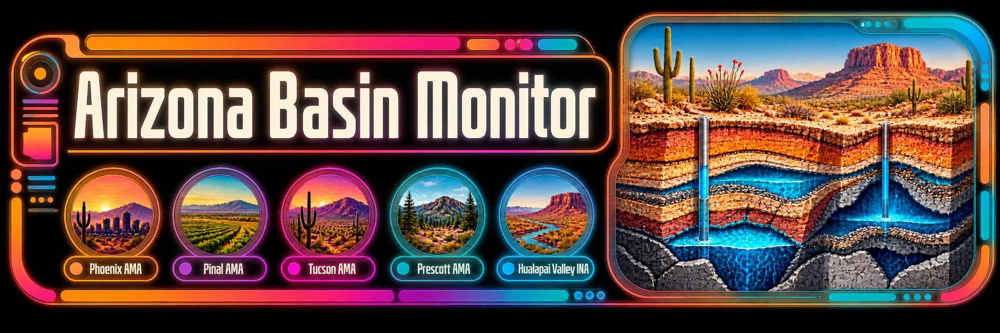
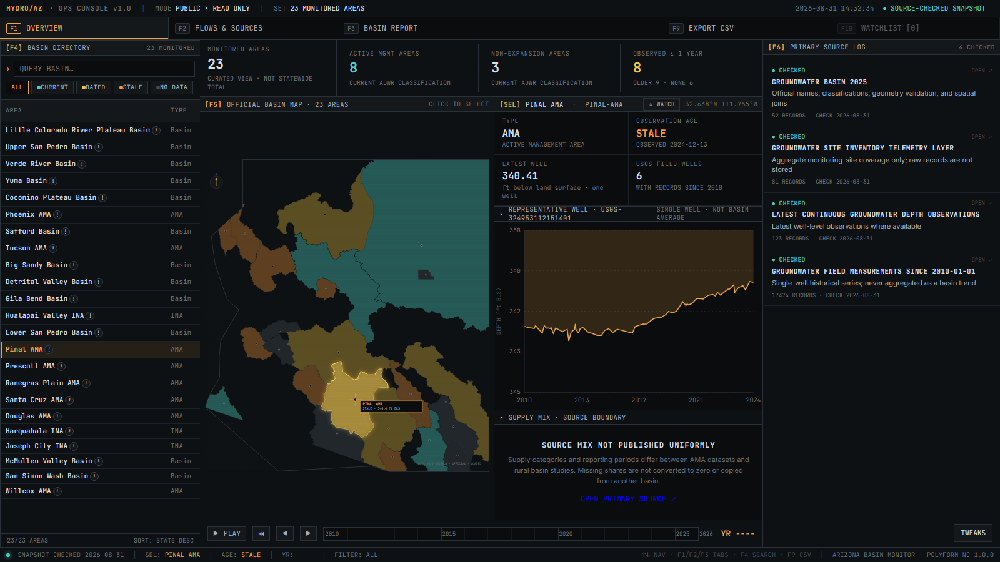
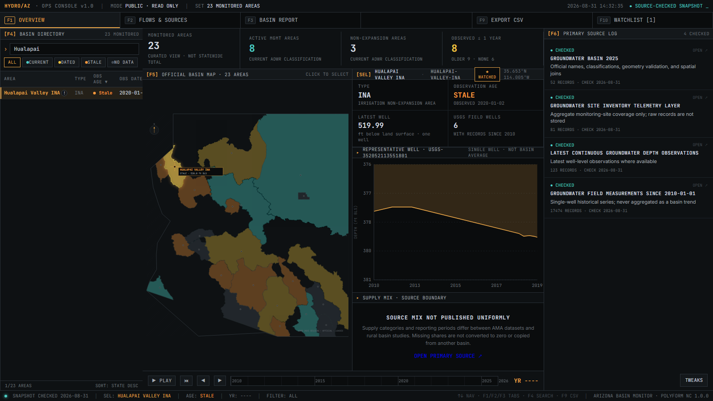
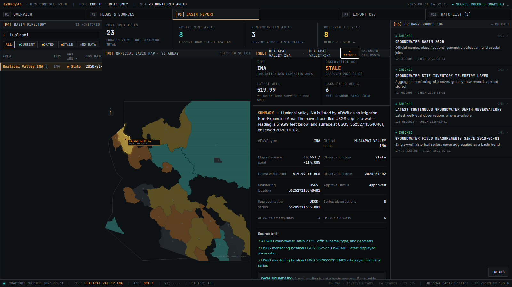

## What is this?

Arizona Basin Monitor is a searchable operations console for 23 monitored groundwater areas in Arizona. It combines current management classifications, official basin boundaries, source coverage, dated well readings, and single-well measurement histories in one interface.

The monitor keeps the difference between a basin and a monitoring well visible. When no comparable basin-wide source exists for deficit, depletion, recharge, withdrawal, storage, or supply mix, the field stays **Unavailable** instead of being estimated.



_The console uses official ADWR geometry and source-linked USGS well observations._

---

## Who is this for?

- **People checking what public groundwater records say about an Arizona basin.** Find an area, inspect the available reading, and follow it back to the monitoring location.
- **Communities comparing management status and reporting coverage.** See which monitored areas are AMAs, INAs, or other groundwater basins and where current observations are available.
- **Reporters, students, researchers, and developers who need the source beside the number.** Export the snapshot without losing observation dates, site IDs, or source links.



_Search, sort, select, and keep a browser-local watchlist without creating an account._

---

## What it actually does

1. **Search and sort 23 monitored areas.** Use the directory or select an area from the map.
2. **Load official basin geometry.** The map requests the current ADWR Groundwater Basin 2025 layer directly rather than bundling hand-drawn boundaries.
3. **Show current management classifications.** The registry includes eight Active Management Areas, three Irrigation Non-Expansion Areas, and twelve additional groundwater basins.
4. **Display dated groundwater observations where available.** Each reading is identified as one well measurement—not a basin average.
5. **Plot a real single-well history.** The chart uses the USGS monitoring location with the most qualifying field measurements in the area since 2010 and names that site above the chart.
6. **Leave unsupported basin metrics unavailable.** The interface does not fabricate a statewide severity score, deficit, depletion percentage, supply mix, or recharge series.
7. **Keep a local watchlist and export CSV.** Watchlist choices stay in browser storage, and exported records retain source and observation fields.

The `Current`, `Dated`, `Stale`, and `No data` labels describe only the age of the newest bundled well observation: up to 30 days, 31–365 days, more than 365 days, or no qualifying reading. They are calculated by this project from source dates. They are not ADWR management designations, groundwater-risk ratings, or basin-wide trend judgments.

---

## Where the data comes from

Arizona Basin Monitor uses primary government sources:

- [ADWR Groundwater Basin 2025](https://azwatermaps.azwater.gov/arcgis/rest/services/Groundwater_Basin_2025/FeatureServer/0) for official basin names, classifications, and geometry.
- [ADWR Active Management Area overview](https://www.azwater.gov/ama/active-management-area-overview) for the current statewide AMA framework.
- [ADWR Hualapai Valley INA](https://www.azwater.gov/ama/ina/hualapai-ina) for the current court-stay notice: the designation order and irrigation restrictions remain in force while appellate review is pending.
- [ADWR Groundwater Site Inventory](https://services.arcgis.com/C34zQ7veRS0V1t04/ArcGIS/rest/services/GWSI_Layers/FeatureServer) for aggregate monitoring-site coverage.
- [USGS Water Data APIs](https://api.waterdata.usgs.gov/docs/ogcapi/) for depth-below-land-surface observations and field-measurement histories.
- [ADWR Supply and Demand](https://www.azwater.gov/supply-demand) is linked as a reference for agency basin studies and water budgets where they exist. Those records are not ingested into the monitor or treated as a uniform daily feed.

The bundled snapshot records three different times separately: when a well was observed, when a source responded, and when this project checked it. A local daily source check validates endpoint availability, schema, and the exact eight-AMA/three-INA managed-area set. It builds an ignored snapshot candidate and compares only source-backed fields, so a new check timestamp alone is not reported as a data change. It does not turn annual reports or irregular measurements into daily data, and it does not publish changes automatically.

The refresh script uses official ADWR geometry transiently to spatially join observations, then stores only derived map centers and aggregate site counts. Raw ADWR geometries and site records are not copied into the repository. Displayed numeric observations come from USGS.



_Every displayed reading links to its monitoring location; missing basin-wide metrics remain unavailable._

---

## Try it yourself

Open [water.scootsolute.org](https://water.scootsolute.org/) with no account or API key. Search for Hualapai Valley, switch between Overview, Flows & Sources, and Basin Report, move through available years, add the area to the watchlist, and export the current snapshot.

---

## Running it locally

### What you will need

- [Node.js](https://nodejs.org/) 20 or newer.
- npm, included with Node.js.
- Network access for the official ADWR map and source-refresh commands. The bundled observation snapshot still renders when a refresh is not running.

### Run it locally

```bash
git clone https://github.com/anitacigawet/Water_Dashboard.git
cd Water_Dashboard
npm ci
npm run dev
```

Open <http://127.0.0.1:3000>.

For a production build:

```bash
npm run build
npm run preview
```

---

## ⚙️ Extreme technicals below

### Data ingestion and daily checks

```bash
npm run data:refresh
npm run data:validate
npm run sources:check
npm run sources:daily
```

`data:refresh` rebuilds the compact, source-linked snapshot from current ADWR geometry and USGS observations. `data:validate` checks the exact stored schema, registry counts, source fields, observation dates, and the no-raw-ADWR-storage boundary. `sources:check` validates the ADWR basin, subbasin, and GWSI services, exact managed-area classifications, USGS OGC schema, and qualifier values, then writes a health report under `artifacts/`. It also attempts scoped ADWR status-page checks; because those pages may reject automated requests, that narrative check is advisory and legal-status changes require manual review.

`sources:daily` is the safe local automation entry point. It obtains a single-run lock, checks every required source, generates and validates an ignored candidate under `artifacts/`, and writes `artifacts/daily-source-check.json`. Required-source failures, unexpected narrative changes, schema changes, a modified baseline, or a changed candidate all fail closed. The separate `npm run data:apply-candidate` command will apply only the exact candidate approved by the latest successful report. The scheduled check does not edit tracked data, commit, push, deploy, or require GitHub Actions.

The maintainer's `npm run autopilot` command wraps that check with a narrower publication policy. An unchanged run only confirms that production is synchronized. An eligible source-backed snapshot change is applied, validated, built, committed to `main`, pushed, and deployed to the existing VPS showroom. Any other tracked diff, source failure, schema or managed-area change, narrative-status concern, divergent branch, deployment-helper mismatch, or failed production browser test stops the run without guessing.

The authoritative records remain structured JSON, not an AI knowledge base. If the project later needs a durable history of runs and field changes, SQLite is the next storage layer. A vector index would be secondary search infrastructure for a large report library—not the authority for published measurements or classifications. See [Local source automation](docs/LOCAL_AUTOMATION.md) for the operating boundary.

### How the repository is organized

- **`src/App.jsx`** — console state, keyboard navigation, watchlist, source-aware report, and CSV export.
- **`src/hydro/registry.js`** — the curated 23-area registry and official source endpoints.
- **`src/hydro/generated/groundwater-snapshot.json`** — compact derived snapshot generated from checked sources.
- **`src/hydro/components/`** — official-geometry map, directory, charts, source rail, and timeline.
- **`src/hydro.css`** — the intentional HYDRO/AZ console visual system.
- **`scripts/refresh-water-data.mjs`** — source fetch, schema validation, spatial join, and snapshot generation.
- **`scripts/compare-snapshots.mjs`** — semantic comparison that ignores check-only timestamps while retaining observation, coverage, classification, and data-state changes.
- **`scripts/daily-source-check.mjs`** — locked local check, candidate generation, validation, and review report.
- **`scripts/apply-snapshot-candidate.mjs`** — hash- and baseline-guarded promotion of a reviewed candidate.
- **`scripts/autopilot-source-update.ps1`** — fail-closed local update, publication, and production-sync controller.
- **`scripts/publish-water-showroom.ps1`** — verified build and water-only VPS publication wrapper.
- **`scripts/deploy-water-showroom.sh`** — staged, rollback-preserving activation helper on the VPS.
- **`scripts/lib/snapshot-semantics.mjs`** — shared definition of a source-backed snapshot change.
- **`scripts/validate-data.mjs`** — registry, observation, provenance, and storage-boundary assertions.
- **`scripts/check-primary-sources.mjs`** — read-only primary-source availability and schema audit.
- **`scripts/verify-console.mjs`** — browser verification for geometry, search, report, watchlist, CSV, themes, and unexpected browser or request failures.
- **`scripts/capture-screenshots.mjs`** — reproducible README screenshots.

See [Data status](docs/DATA_STATUS.md) for the exact field boundary and update semantics.

### Testing and maintenance

```bash
npm run lint
npm run build
npm audit --omit=dev
```

With the development server running:

```bash
npm run verify
npm run screenshots
```

The browser verifier requires the ADWR geometry request to succeed. It checks all 23 directory rows, the Hualapai report path, watchlist persistence, CSV export, theme controls, unsupported-claim removal, browser errors, and request failures.

ADWR publishes a [GIS data disclaimer](https://www.azwater.gov/gis-data-and-maps). This repository does not grant reuse rights to ADWR or USGS material; review the source terms before redistributing derived data outside this project.

### Contributing and maintenance

Open an issue before submitting a large change. Any new quantitative value must include its primary source, unit, geographic definition, observation or reporting period, retrieval date, and derivation method. A missing value stays unavailable; zero is reserved for a source-reported zero.

See [CONTRIBUTING.md](CONTRIBUTING.md) for the full process.

### Credits

Arizona Basin Monitor is directed and maintained by James with assistance from generative AI development tools.

The Arizona Department of Water Resources and U.S. Geological Survey publish the source material used by the monitor. Their inclusion does not imply endorsement, and their data retain their own terms and attribution requirements.

### License

Arizona Basin Monitor is available under the [PolyForm Noncommercial License 1.0.0](LICENSE). Noncommercial use, modification, and redistribution are permitted under that license; commercial use is not granted.
